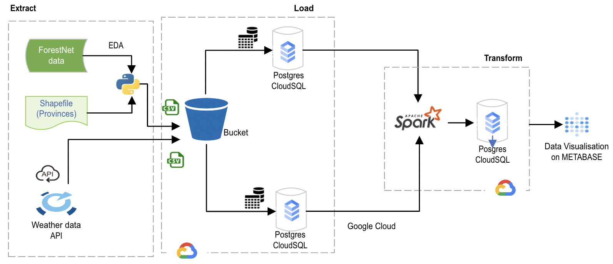

# ucl-forest-weather

## General Description

Data Pipeline to store forest satellite images and weather data to better analyse deforestation causes.

## Business Goals

The goal of this project is to combine spatial image deforestation data with historical and contemporary weather data, which includes tracking average temperature and rainfall. We have initially focused on Indonesia, though there is potential for expansion in the future. Our goal is to enhance deforestation analysis by providing a data pipeline and dashboard that can be used in the future to inform future decision-makers to identify the most effective interventions would be to address the deforestation crisis.

## Architecture Overview

### Architecture Diagram

The architecture depicted in the diagram outlines the data workflow for our deforestation analysis project, which is broken down into three primary stages: Extract, Load, and Transform (ELT).

#### Extract
The data extraction process involves three main data sources:

1.	ForestNet Data: Satellite imagery data, along with the deforestation causes from ForestNet are  processed to identify deforestation events.

2.	Shapefile(Provinces):Geospatial data of provinces is extracted from shapefiles to provide context and mapping capabilities. This shapefile is the combined with the deforetstaion dataset to identify the correlation between provinces and deforestation causes.

3.	Weather API: Historical weather data is fetched from a weather API.

After conducting an exploratory data analysis, The processed ForestNet data and weather data are exported as CSV files, and stored in a GCP Bucket for temporary holding.

#### Load

The CSV files from the bucket are then loaded into Postgres CloudSQL, a managed database service on Google Cloud Platform. This service is used for its reliable storage and retrieval capabilities.

#### Transform

Apache Spark, an engine for large-scale data processing, is then used to perform data transformations. It accesses the data from Postgres CloudSQL, where complex analytical transformations are executed.
After transformation, the processed data is written back to Postgres CloudSQL, ready to be utilized for further analysis or to be queried by data visualization tools.

#### Data Visualization
The transformed data is then connected to METABASE, a business intelligence tool. In METABASE, we create interactive dashboards that visualize the deforestation status, providing insights through various charts and maps that leverage the merged and transformed deforestation and weather data.
This end-to-end process allows for the data to be managed and analyzed efficiently, supporting data-driven decisions in deforestation management and environmental conservation efforts.

